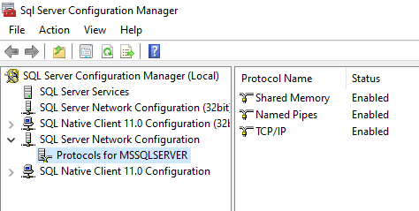
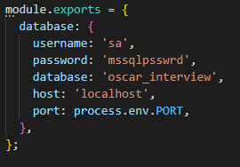
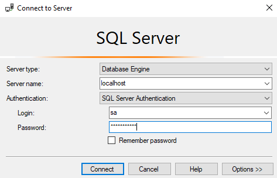
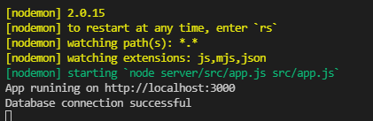
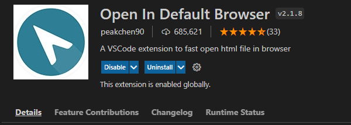
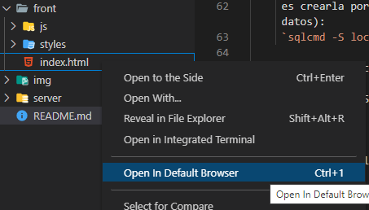

# Factory App

### Project Structure

Main structure of node.js project. Folders / files:

- <b>front</b>:
  - <b>js</b>
    - <b>jquery.min.js</b>
    - <b>routesFile.js</b>
    - <b>script.js</b>
  - <b>styles</b>
    - <b>styles.css</b>
  - <b>index.html</b>Entry point
- <b>img</b>
- <b>server</b>
  - <b>src</b>
    - <b>database</b>
      - <b>db.js</b>
    - <b>models</b>
      - <b>associations.js</b>
      - <b>Car.js</b>
      - <b>Order.js</b>
      - <b>OrdersProductionDay.js</b>
      - <b>ProductionDay.js</b>
    - <b>routes</b>
      - <b>cars.js</b>
      - <b>orders.js</b>
      - <b>ordersProductionDays.js</b>
      - <b>predefineValues.js</b>
      - <b>productionDays.js</b>
    - <b>app.js</b>Entry point
  - <b>.eslintrc</b>. Linter JS, static code analyzer. See [EsLint Docs](https://eslint.org/docs/user-guide/configuring/configuration-files).
  - <b>.gitignore</b>
  - <b>.ecosystem.config.js</b>
  - <b>package.json</b>.
- <b>README</b>

### Importar proyecto a Visual Studio Code

- Clonar proyecto desde la plataforma Github: Ejecutar en consola
  ```
  git clone https://github.com/oscarvargas4/factoryApp.git
  ```

### Inicialización del Proyecto

1. Instalar los modulos de Node.js `node_modules`:

```
npm install
```

2. Asegurarse de tener instalado Microsoft SQL Server y tener los protocolos habilitados:
   

3. Configurar los parámetros de configuración en el archivo `server/ecosystem.config.js` de Sequelize según los parámetros propios de SQL Server:

   - Configuración Sequelize en archivo `server/ecosystem.config.js`:

     

   - Configuración Microsoft SQL Server:

     

4. Crear la base de datos en Microsoft SQL Server con la cual se trabajará, en este caso se denominará `oscar_interview`.

   - La primera opción
     es crearla por consola (recordar cambiar las flags -S (server), -U (username), -P (password), -Q(query) según vuestra configuración de SQL Server y el nombre de la base de datos):
     `sqlcmd -S localhost -U sa -P mssqlpsswrd -Q "CREATE DATABASE oscar_interview;"`

   - La segunda opción es realizar una query en Microsoft SQL Server:
     ```
     CREATE DATABASE oscar_interview;
     GO
     ```

5. Una vez creada la base de datos, se arranca el servidor (recordar posicionarse en la carpeta server (comando: `cd server`)):

   ```
   npm run dev
   ```

   Asegurarse de tener en la consola el siguiente log donde se asegura que el servidor arrancó correctamente:

   

6. Para abrir el front, se recomienda tener instalada la extensión de Visual Studio Code denominada [Open In Default Browser Docs](https://marketplace.visualstudio.com/items?itemName=peakchen90.open-html-in-browser).

   

   A continuación se procede a abrir el Entry Point del front:

   

7. Si se desea reiniciar la base de datos en algún momento, ir al archivo `app.js` y configurar en la línea #38 de la siguiente forma:

```
await sequelize.sync({ force: true });
```

Después guardar el archivo para su pertinente ejecución.

Cada vez que se realizará un cambio en el código, la base de datos se reiniciará. En caso de que esto no se desee, configurar a `force: false`.
